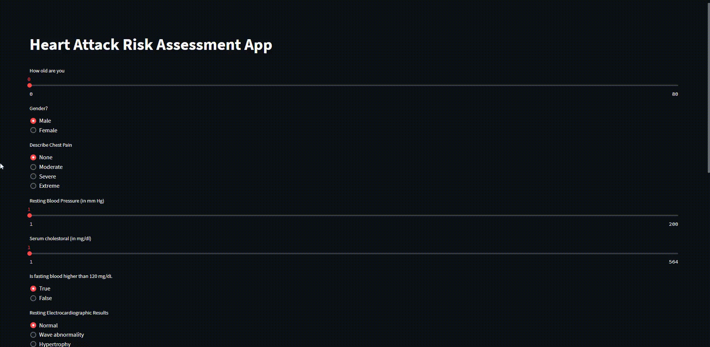

# heart-attack-analysis-prediction-project
Building, optimizing, and Deploying ML model to predict the chances of a heart attack using the Heart Attack Prediction Dataset

Link (from Kaggle) to dataset: https://www.kaggle.com/datasets/rashikrahmanpritom/heart-attack-analysis-prediction-dataset

Use: " kaggle datasets download -d rashikrahmanpritom/heart-attack-analysis-prediction-dataset --unzip -p data\raw " in the terminal to download the dataset, and unzip the file into the directory

Here is a web application to predict the chances of a heart attack:

http://localhost:5000/

